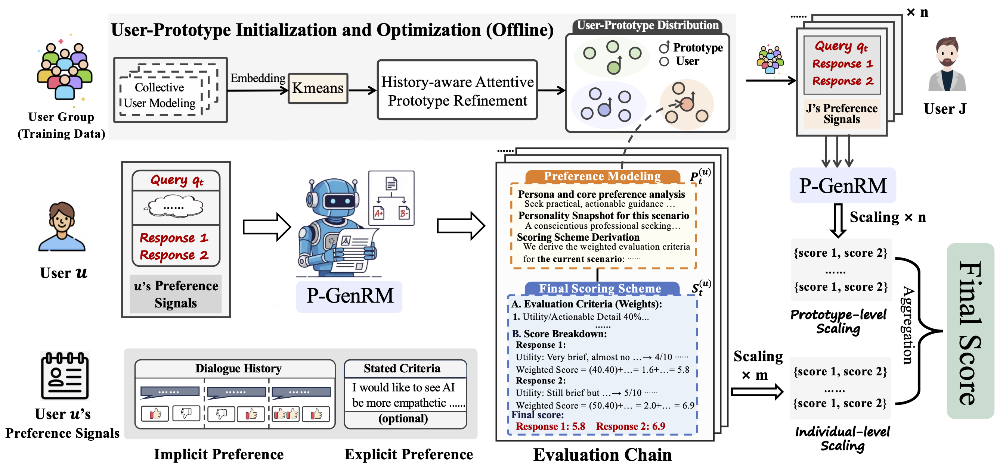
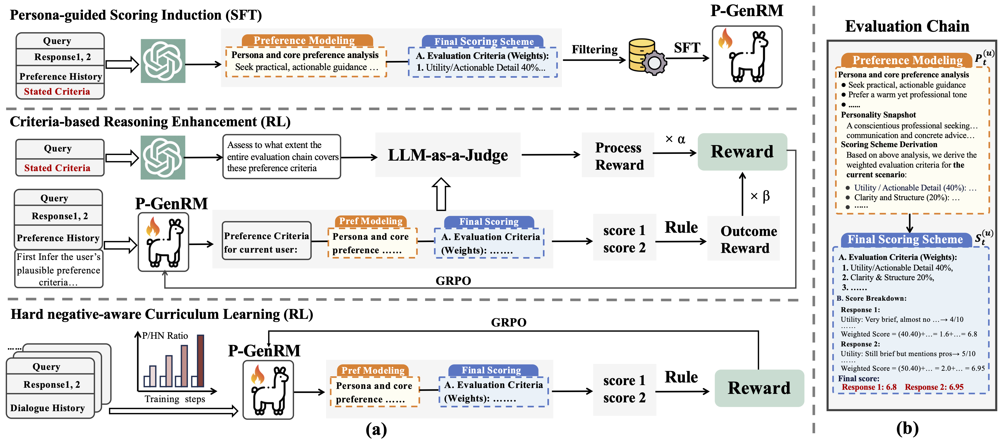
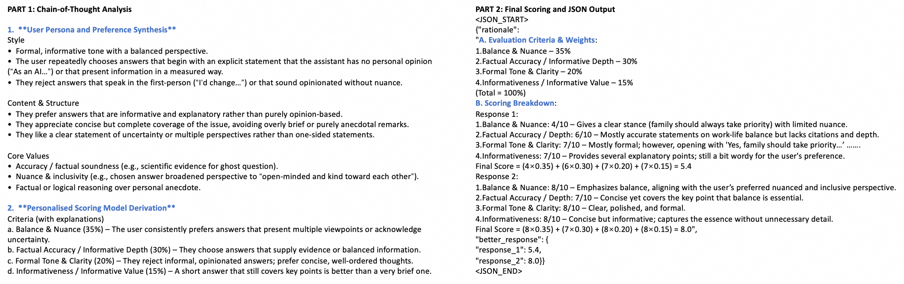
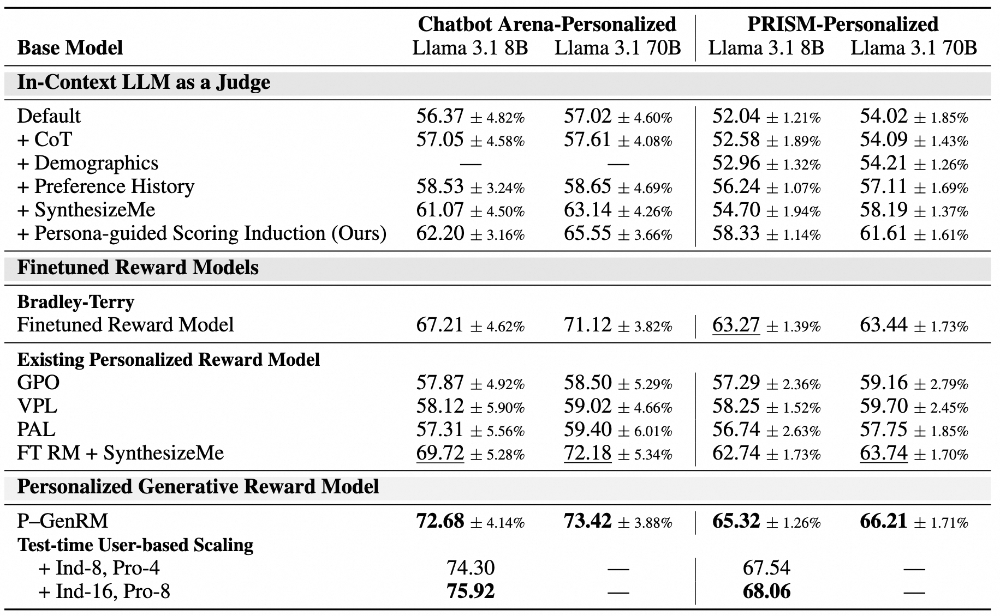
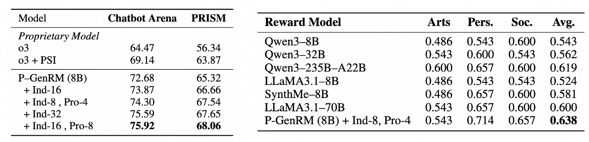

# P-GenRM

The official repository for "P-GenRM: Personalized Generative Reward Model with Test-time User-based Scaling".

More details about code, weights will be released, stay tuned!


## Introduction
Consider an AI assistant interacting with two users: one who appreciates witty humor and another who prefers concise professionalism. How can the model adapt its responses to such diverse preferences? Traditional RLHF relies on a single reward model, resulting in uniform behavior. Existing approaches to personalized alignment often reduce diverse individual preferences to fixed rules, failing to capture contextual variations (e.g., preferring brevity while driving but richness in casual conversations). They also show limited generalization to new users lacking historical data.


In this work, we propose P-GenRM, the **first personalized generative reward model with test-time user-based scaling**. P-GenRM infers adaptive user persona and preference analysis from hybrid preference signals, generates dynamic scoring rubrics, and assesses candi-
date responses accordingly. At test-time, P-GenRM can aggregate multiple individual-level scoring
schemes and incorporate similar users’ preferences to improve scoring accuracy and generalization.

## Key Features
**🎯Personalized alignment:** P-GenRM incorporates user preferences into generative reward modeling, supporting the evaluation of responses in open-ended settings such as dialogues.

**🔮Adaptive Preference Modeling:**  P-GenRM can dynamically infer **adaptive** preference analyses and scoring rubrics for different users and scenarios, rather than relying on a fixed and limited set of principles.

**🏅SOTA Performance:** P-GenRM achieves SOTA performance on PersonalRewardBench, and demonstrates strong generalization on an OOD dataset.

**⚡Test-time Scalability:** P-GenRM significantly improves performance via dual-granularity **test-time user-based scaling**.


## How P-GenRM Works

>P-GenRM transforms preference signals
into structured evaluation chains that derive adaptive personas and scoring rubrics
across various scenarios. It further clusters users into User Prototypes and introduces a dual-granularity scaling mechanism: at the individual level, it adaptively
scales and aggregates each user’s scoring scheme; at the prototype level, it incorporates preferences from similar users.

## Training Pipeline

>The three-stage training framework of P-GenRM. (1) Persona-guided Scoring Induction (PSI) via supervised fine-tuning, which translates
hybrid preference signals into explicit evaluation chains; (2) Criteria-based Reasoning Enhancement
(CRE) with reinforcement learning, which strengthens evaluation chain generation, especially in set-
tings with missing preference information; and (3) hard-negative-aware curriculum learning, which
progressively improves robustness in handling challenging instances.


## P-GenRM Evaluation Chain Example
Here we provide an example of a P-GenRM's evaluation chain.  Part 1 infers personalized scoring rubrics for current scenario, while Part 2 applies them to evaluate candidate responses and compute a weighted overall score.

>More details regarding *user input*, *candidate responses*, and *history choices* can be found in [single_inference](inference/single_inference.py ).


## Result


> P-GenRM outperforms other state-of-the-art personalized reward models on PersonalRewardBench.





> **Left:** Test-time User-based scaling significantly improves P-GenRM's performance with fewer increases in scaling operations (e.g. 16+8 vs 32).  
> **Right:** P-GenRM shows strong generalization on an OOD dataset, LaMP-QA.

## 🚀 Quick Start
### Installation
```bash
pip install -r requirements.txt
```
### Download 
Download P-GenRM-8B-ChatbotArena, 
P-GenRM-8B-PRISM, Qwen3-Embedding-0.6B, PersonalRewardBench and PRISM datasets from Hugging Face.

<p align="center">
🤗 <a href="https://huggingface.co/Tongyi-ConvAI/P-GenRM-8B-ChatbotArena">P-GenRM-8B-ChatbotArena</a>&nbsp&nbsp | &nbsp&nbsp
🤗 <a href="https://huggingface.co/Tongyi-ConvAI/P-GenRM-8B-PRISM">P-GenRM-8B-PRISM</a>&nbsp&nbsp | &nbsp&nbsp
       🤗 <a href="https://huggingface.co/Qwen/Qwen3-Embedding-0.6B">Qwen3-Embedding-0.6B</a>&nbsp&nbsp | &nbsp&nbsp <br>
       🤗 <a href="https://huggingface.co/datasets/MichaelR207/prism_personalized_0125">PRISM_personalized</a>&nbsp&nbsp | &nbsp&nbsp🤗 <a href="https://huggingface.co/datasets/MichaelR207/chatbot_arena_personalized_0125">Chatbot_Arena_personalized</a> | &nbsp&nbsp🤗 <a href="https://huggingface.co/datasets/HannahRoseKirk/prism-alignment">PRISM</a>&nbsp&nbsp
</p>
Place it under the "data" directory. The project structure should be:

```bash
P-GenRM/
├── assets/
├── checkpoints/
│   ├── P-GenRM-8B-ChatbotArena/
│   └── P-GenRM-8B-PRISM/
├── data/
│   ├── chatbot_arena_personalized_0125/
│   ├── prism_personalized_0125/
│   └── prism-alignment/
├── inference/
├── pre_process/
├── prototype_learning/
├── Qwen3-Embedding-0.6B
├── utils.py
└── README.md
```

### Single Inference
Run the following command in the root directory for a single test. You can customize the "user_input","historical_choices" and "candidate_responses" variables in the script.
```bash
python inference/single_inference.py 
```
### Batch Inference
We recommend using vLLM for deployment and batch inference. To run experiments on PersonalRewardBench, execute the following command in the root directory.
```bash
bash inference/vllm_batch_inference.sh --dataset prism
bash inference/vllm_batch_inference.sh --dataset chatbotarena
```
### Test-time User-based Scaling
P-GenRM summarizes user prototypes on the training set. First, run the following code to generate two CSV files that record the analysis of users’ historical preferences (saved as path/to/user_history_train_chatbot.csv | path/to/user_history_train_prism.csv).
```bash
bash inference/vllm_batch_inference.sh --dataset prism --test_split_name val
bash inference/vllm_batch_inference.sh --dataset chatbotarena --test_split_name val
```
Then run following code to generate the optimized user prototypes. 
```bash
cd prototype_learning
bash prototype_learning.sh path/to/user_history_train_chatbot.csv path/to/user_history_train_prism.csv
```
Finally, run the following command to evaluate P-GenRM with test-time user-based scaling.
```bash
cd prototype_learning
bash  scaling_with_proto.sh chatbot
bash  scaling_with_proto.sh prism
```

## Acknowledgement

We extend our gratitude to the authors and contributors of these projects.
- [veRL](https://github.com/volcengine/verl)
- [vLLM](https://github.com/vllm-project/vllm)
- [PRISM](https://huggingface.co/datasets/HannahRoseKirk/prism-alignment)
- [SynthesizeMe](https://github.com/SALT-NLP/SynthesizeMe)


