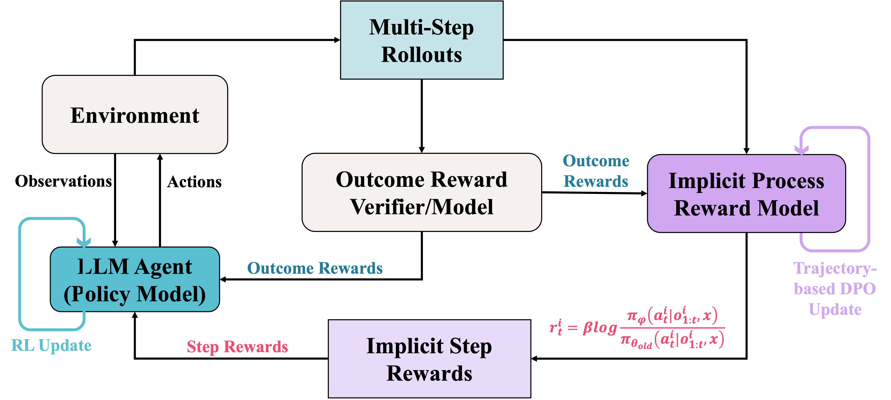
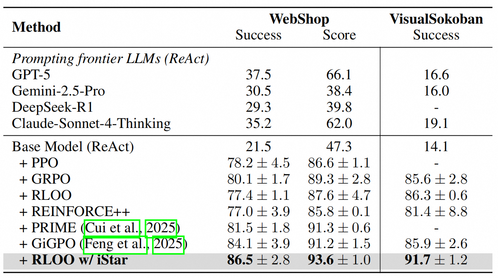

# Agentic Reinforcement Learning with Implicit Step Rewards

## :tada:News
- [2025.09.28] Release our paper on arXiv. See [here](http://arxiv.org/abs/2509.19199).

## Introduction


Large language models (LLMs) are increasingly developed as autonomous agents using reinforcement learning (agentic RL) that reason and act in interactive environments.
However, sparse and sometimes unverifiable rewards make it extremely challenging to assign credit when training LLM agents that serve as a policy.
Recent work attempts to integrate process supervision into RL but suffers from biased annotation, reward hacking, high-variance from overly fine-grained rewards or failtures when state overlap is rare.
We therefore introduce **iStar**, a general credit-assignment strategy that integrates seamlessly with standard RL algorithms without relying on additional rollouts or explicit step labels.
Particularly, we alternatively optimize an implicit process reward model (PRM) with the policy model to generate implicit step rewards via a trajectory-based DPO objective. Theoretical analysis shows that this learning objective produces a step-wise reward function.
Then the implicit step rewards are used to compute step-level advantages, which are combined with trajectory (or episode)-level advantages for policy updates, creating a self-reinforcing training loop.
We evaluate our method on three challenging agent benchmarks, including WebShop and VisualSokoban, as well as open-ended social interactions with unverifiable rewards in SOTOPIA. 
Crucially, **iStar** shows superior performance over frontier LLMs and strong RL baselines across domains, achieving state-of-the-art results with higher sample-efficiency and training stability.
Further analysis also demonstrates efficient exploration by **iStar** with increased rewards in both step- and episode-level while maintaining fewer steps to achieve task success.
Code will be available soon.

## Results


## Installation
### Install veRL
```bash
conda create -n istar python==3.12 -y
conda activate istar

pip3 install torch==2.6.0 --index-url https://download.pytorch.org/whl/cu124
pip3 install flash-attn==2.7.4.post1 --no-build-isolation

pip3 install -e .

pip3 install vllm==0.8.5
```

### Install Supported Environments
> &#x26a0;&#xfe0f; :warning:
> To run an agent in any of these environments, please first install the corresponding environment. 
> Installing each environment in its own conda environment is recommended.

1. WebShop
WebShop requires Python <=3.10, so create a new **istar-webshop** environment:
```bash
conda create -n istar-webshop python==3.10 -y
conda activate istar-webshop
```
Install WebShop:
```bash
cd ./agent_system/environments/env_package/webshop/webshop
./setup.sh -d all
```
Note: If you encounter issues with gdown, you may need to visit https://drive.google.com/, get your Google Drive cookie, and paste it into .cache/gdown/cookies.txt. Or you may need to manually download the files.

After WebShop is installed, return to the root directory of the repository and install the verl package:
```bash
cd iStar
pip3 install torch==2.6.0 --index-url https://download.pytorch.org/whl/cu124
pip3 install flash-attn==2.7.4.post1 --no-build-isolation
pip3 install -e .
pip3 install vllm==0.8.5
```
2. Sokoban
```bash
pip install matplotlib
pip install gym==0.26.2
pip install gym_sokoban==0.0.6
```

## Run Examples
We provide running scripts in the "examples/" directory for training agents in different environments.

Here are some examples:
1. iStar
```bash
bash examples/istar_trainer/run_webshop.sh # WebShop
```
```bash
bash examples/istar_trainer/run_sokoban.sh # Sokoban
```
2. RLOO
```bash
bash examples/rloo_trainer/run_webshop.sh # WebShop
```
```bash
bash examples/rloo_trainer/run_sokoban.sh # Sokoban
```
3. GRPO
```bash
bash examples/grpo_trainer/run_webshop.sh # WebShop
```
```bash
bash examples/grpo_trainer/run_sokoban.sh # Sokoban
```
4. REINFORCE++
```bash
bash examples/reinforce_plus_trainer/run_webshop.sh # WebShop
```
```bash
bash examples/reinforce_plus_trainer/run_sokoban.sh # Sokoban
```
5. PPO
PPO is not currently supported for multi-modal LLM agents.
```bash
bash examples/ppo_trainer/run_webshop.sh # WebShop
```
6. GiGPO
```bash
bash examples/gigpo_trainer/run_webshop.sh # WebShop
```
```bash
bash examples/gigpo_trainer/run_sokoban.sh # Sokoban
```
7. PRIME
PRIME is only applicable to tasks with binary outcome rewards (using cross-entropy loss for implicit PRM training).
```bash
bash examples/prime_trainer/run_webshop.sh # WebShop
```

## Acknowledgement
We extend our gratitude to the authors and contributors of these projects.
- [veRL](https://github.com/volcengine/verl)
- [veRL-agent](https://github.com/langfengQ/verl-agent?tab=readme-ov-file#citation)


## :balloon:Citation

Please cite our paper as:

```bash
@article{liu2025onlineprocessreward,
      title={Agentic Reinforcement Learning with Implicit Step Rewards},
      author={Xiaoqian Liu and Ke Wang and Yuchuan Wu and Fei Huang and Yongbin Li and Junge Zhang and Jianbin Jiao},
      year={2025},
      eprint={2509.19199},
      archivePrefix={arXiv},
      primaryClass={cs.CL},
      url={https://arxiv.org/abs/2509.19199},
}

``` 
